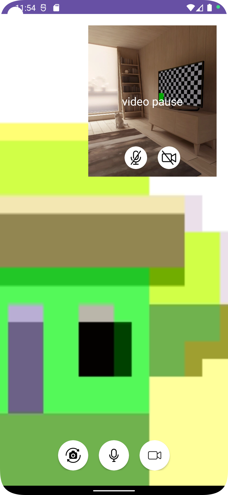

# Twilio Video Calling Android App

## Features

- [x] Video conferencing with real-time video and audio
- [x] Enable/disable camera
- [x] Mute/unmute mic
- [x] Switch between front and back camera

## Requirements
Room name
Access token

## How to generate token 
please visit your twilio console account

link :- <a href="https://console.twilio.com/us1/develop/video/manage/video-credentials?frameUrl=/console/video/project/testing-tools"> Link </a>

### Start Video Call
 
step 1:- enter room name
step 2:- enter token and press on create room

### Join Video Call

step 1:- enter room name
step 2:- enter token and press on join room

## See Demo 

